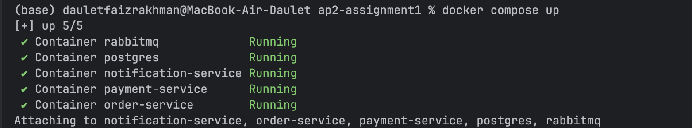
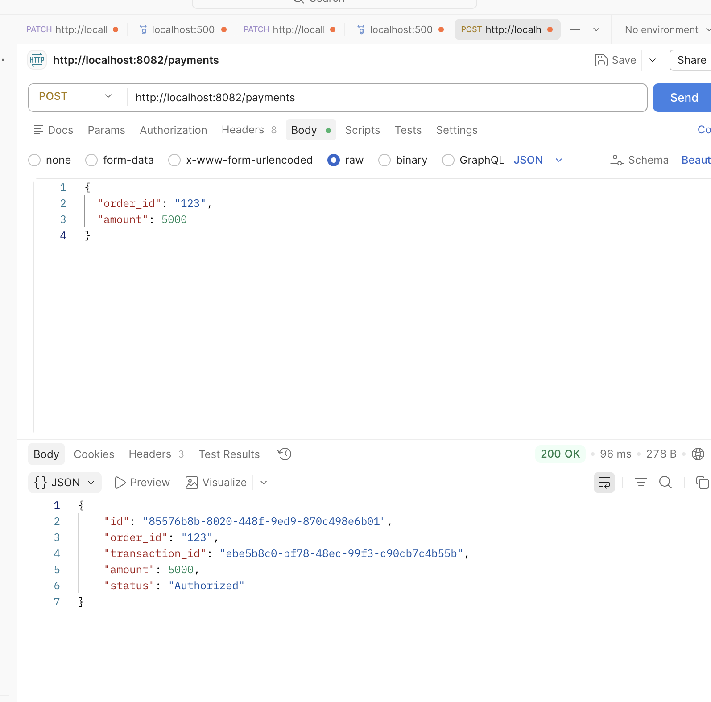
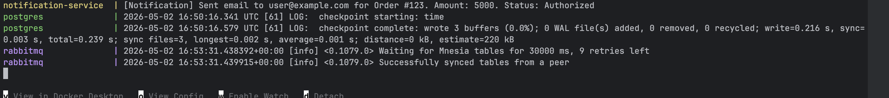

# Assignment 3 — Event-Driven Architecture with Message Queues

## Student Information

* **Name:** Alikhan Faizrakhman
* **Group:** SE-2408
* **Course:** Advanced Programming 2
* **Assignment:** Assignment 3 — Event-Driven Architecture with Message Queues

---

## Project Overview

This project extends Assignment 2 by adding an event-driven communication flow using RabbitMQ.

In Assignment 2, the Order Service and Payment Service communicated synchronously using gRPC. In Assignment 3, a new Notification Service was added to make notifications asynchronous and decoupled.

Main event-driven flow:

Payment Service → RabbitMQ Message Broker → Notification Service

After a payment is successfully created and saved to the database, the Payment Service publishes a payment event to RabbitMQ. The Notification Service listens to the `payment.completed` queue and simulates sending an email by printing a notification log to the console.

---

## Services

The system consists of three microservices:

* **Order Service**
* **Payment Service**
* **Notification Service**

Infrastructure components:

* **PostgreSQL**
* **RabbitMQ**
* **Docker Compose**

---

## Architecture Diagram

```text
+-------------------+
|   Order Service   |
|   REST + gRPC     |
+-------------------+
          |
          | gRPC
          v
+-------------------+        publishes event        +-------------------+
|  Payment Service  | ----------------------------> |     RabbitMQ      |
| REST + gRPC       |        payment.completed      | Message Broker    |
+-------------------+                               +-------------------+
                                                            |
                                                            | consumes event
                                                            v
                                                   +----------------------+
                                                   | Notification Service |
                                                   | Consumer             |
                                                   +----------------------+
```

---

## Architecture Description

The Payment Service acts as a producer. After a payment is successfully saved in the database, it creates a payment event and publishes it to RabbitMQ.

The Notification Service acts as a consumer. It listens to the `payment.completed` queue. When it receives a message, it logs a simulated email notification:

```text
[Notification] Sent email to user@example.com for Order #123. Amount: 5000. Status: Authorized
```

The Notification Service is fully decoupled from the Order Service and Payment Service. It does not communicate with them directly using REST or gRPC. It only receives events through RabbitMQ.

---

## Event Payload

The event is sent as JSON and contains:

```json
{
  "event_id": "unique-event-id",
  "order_id": "123",
  "amount": 5000,
  "customer_email": "user@example.com",
  "status": "Authorized"
}
```

---

## Reliability and ACK Logic

The Notification Service uses manual acknowledgments.

Auto-ACK is disabled. A message is acknowledged only after the notification log is successfully printed.

If message parsing fails, the message is rejected using `Nack()`. If notification processing succeeds, the message is confirmed using `Ack()`.

This guarantees better reliability and prevents message loss if the consumer crashes during processing.

The queue is also configured as durable so that messages survive broker restart.

---

## Idempotency Strategy

The Notification Service uses an in-memory map to store processed `event_id` values.

Before printing a notification, the service checks whether the event has already been processed.

If the same event is delivered twice, the service skips it and does not print the notification again.

This prevents duplicate notification processing and satisfies idempotency requirements.

---

## Docker Compose

The whole system runs using Docker Compose.

Included components:

* order-service
* payment-service
* notification-service
* postgres
* rabbitmq

Run the project:

```bash
docker compose up --build
```

If the images are already built:

```bash
docker compose up
```

Stop the project:

```bash
docker compose down
```

---

## How to Test

### 1. Start all services

```bash
docker compose up
```

### 2. Send payment request using Postman

Method:

```text
POST
```

URL:

```text
http://localhost:8082/payments
```

Body:

```json
{
  "order_id": "123",
  "amount": 5000
}
```

Expected response:

```json
{
  "id": "...",
  "order_id": "123",
  "transaction_id": "...",
  "amount": 5000,
  "status": "Authorized"
}
```

### 3. Check Notification Service logs

Expected output:

```text
[Notification] Sent email to user@example.com for Order #123. Amount: 5000. Status: Authorized
```

---

## RabbitMQ Management UI

RabbitMQ dashboard:

```text
http://localhost:15672
```

Login:

```text
guest
```

Password:

```text
guest
```

---

## Evidence / Screenshots

### 1. Docker Compose Running



### 2. Successful Payment Request in Postman



### 3. Notification Service Log



### 4. RabbitMQ Management UI


---

## Deliverables Included

* Source code for all three services
* Docker Compose file
* Architecture Diagram
* README with ACK logic and Idempotency explanation

This matches the Assignment 3 requirements.

---

## Conclusion

This assignment demonstrates an event-driven architecture using RabbitMQ.

The Payment Service publishes payment events after successful database transactions. The Notification Service consumes these events asynchronously and processes notifications independently.

The project uses:

* RabbitMQ for asynchronous messaging
* Manual ACKs for reliability
* Durable queues for persistence
* Idempotency checks for duplicate prevention
* Docker Compose for full environment orchestration

This implementation follows the required EDA design and demonstrates reliable producer-consumer communication between microservices.
